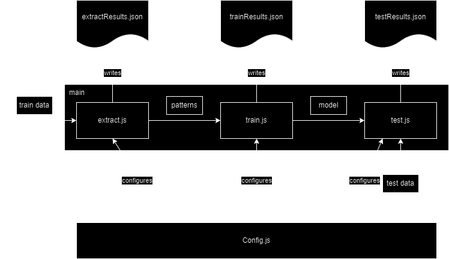

# Introduction
This package offers a shift-reduce parser for dependency grammar that can be trained on corpora from Universal Dependencies. It uses a back propagation network from TensorFlow to train the model.


# Installation
```bash
npm install dep-parser
```

# Structure of the module
Here is an overview of the modules and classes it consists of:


# Usage
The scripts for extracting feature patterns, training and testing the model are configured in `Config.js`. It allows configuration of all input and output files, configuration of the feature extraction, the neural network itself, and training.

There is a Nodejs script `main` that has the following options:
- extract: Extract training patterns from a training corpus
- train: Train the model
- test: Test the model on a test corpus
- iterate: Iterate  a list of commands over a configuration item and a list of possible values



Example usage: `main iterate` with the following iterate options:
```json
iterate: {
    commands: ['train', 'test'],
    configItem: ['TensorFlow', 'epochs'],
    values: [30, 40, 50]
  }
```
will run train followed by test for three values of epochs.


## Extraction configuration items
| Variable | Description | Default value | Environment variable |
| --- | --- | --- | --- |
| corpusTrain | Path to the training corpus | ../ud-treebanks-v2.14/UD_English-GUM/en_gum-ud-train.conllu | CORPUS_TRAIN |
| failedSentencesFile | Path to the file where failed sentences are saved | | FAILED_SENTENCES_FILE |
| formFile | Path to the form file | ./data/output/[corpus-acronym-]form.json| FORM_FILE |
| lemmaFile | Path to the lemma file | ./data/output/[corpus-acronym-]lemma.json | LEMMA_FILE |
| upostagFile | Path to the upostag file | ./data/output/[corpus-acronym-]upostag.json | UPOSTAG_FILE |
| patternsFile | Path to the patterns file | ./data/output/[corpus-acronym-]patterns.json | PATTERNS_FILE |
| extractResultsFile | Path to the file where the results of the extraction are saved | ./data/output/extractResults-[timestamp] | EXTRACT_RESULTS_FILE |
| stackDepth | Depth of the stack | 3 | STACK_DEPTH |
| bufferDepth | Depth of the buffer | 3 | BUFFER_DEPTH |

## Training configuration items
| Variable | Description | Default value | Environment variable |
| --- | --- | --- | --- |
| patternsFile | Path to the patterns file | | PATTERNS_FILE |
| formFile | Path to the form file | | FORM_FILE |
| lemmaFile | Path to the lemma file | | LEMMA_FILE |
| upostagFile | Path to the upostag file | | UPOSTAG_FILE |
| modelFile | Path to the model file | | MODEL_FILE |
| trainResultsFile | Path to the file where the results of the training are saved | ./data/output/trainResults-[timestamp] | TRAIN_RESULTS_FILE |

## Tensorflow configuration items
| Variable | Description | Default value | Environment variable |
| --- | --- | --- | --- |
| TensorFlow.layers[0].units | Number of units in the input layer | | TENSORFLOW_INPUTLAYER_UNITS |
| TensorFlow.layers[0].activation | Activation function for the input layer | | TENSORFLOW_INPUTLAYER_ACTIVATION |
| TensorFlow.layers[1].units | Number of units in the hidden layer | | TENSORFLOW_HIDDEN_LAYER_UNITS |
| TensorFlow.layers[1].activation | Activation function for the hidden layer | | TENSORFLOW_HIDDENLAYER_ACTIVATION |
| TensorFlow.layers[2].units | Number of units in the output layer | | TENSORFLOW_OUTPUT_LAYER_UNITS |
| TensorFlow.layers[2].activation | Activation function for the output layer | | TENSORFLOW_OUTPUTLAYER_ACTIVATION |
| TensorFlow.optimizer | Optimizer for the model | | TENSORFLOW_OPTIMIZER |
| TensorFlow.loss | Loss function for the model | | TENSORFLOW_LOSS |
| TensorFlow.metrics | Metrics for the model | | TENSORFLOW_METRICS |
| TensorFlow.batchSize | Batch size for the model | | TENSORFLOW_BATCH_SIZE |
| TensorFlow.epochs | Number of epochs for the model | | TENSORFLOW_EPOCHS |

## Testing configuration items
| Variable | Description | Default value | Environment variable |
| --- | --- | --- | --- |
| corpusTest | Path to the test corpus | ../ud-treebanks-v2.14/UD_English-GUM/en_gum-ud-train.conllu | CORPUS_TEST |
| testResultsFile | Path to the file where the results of the testing are saved | ./data/output/testResults-[timestamp] | TEST_RESULTS_FILE |
| modelFile | Path to the model file | ./data/output/testResults-[timestamp] | MODEL_FILE |

## Iteration configuration items
| Variable | Description | Default value | Environment variable |
| --- | --- | --- | --- |
| iterate.commands | A list of commands to execute (array) | ['train', 'test'] | - |
| iterate.configItem | Path tot the configuration item to iterate over (array of attribute names) | ['TensorFlow', 'epochs'] | - |
| iterate.values | A list of possible values to iterate (array) | [30, 40, 50] | - |


# Conllu Format
The Connllu format is used by Universal Dependencies to represent dependency trees. The format is defined in the [Universal Dependencies](https://universaldependencies.org/format.html) documentation. An example of a sentence in CoNLL-U format is:
```
# sent_id = GUM_academic_exposure-4
# s_prominence = 4
# s_type = decl
# transition = smooth-shift
# text = However, it is not enough to have attained such native-like levels.
1	However	however	ADV	RB	_	6	advmod	6:advmod	Discourse=evaluation-comment:13->8:3:lex-indwd-78;adversative-contrast:13->7:0:2:orp-however-73|MSeg=How-ever|SpaceAfter=No
2	,	,	PUNCT	,	_	1	punct	1:punct	_
3	it	it	PRON	PRP	Case=Nom|Gender=Neut|Number=Sing|Person=3|PronType=Prs	6	expl	6:expl	Entity=(18-event-new-cf2-1-cata)
4	is	be	AUX	VBZ	Mood=Ind|Number=Sing|Person=3|Tense=Pres|VerbForm=Fin	6	cop	6:cop	_
5	not	not	PART	RB	Polarity=Neg	6	advmod	6:advmod	_
6	enough	enough	ADJ	JJ	Degree=Pos	0	root	0:root	_
7	to	to	PART	TO	_	9	mark	9:mark	Entity=(18-event-acc:com-cf2-3-coref
8	have	have	AUX	VB	VerbForm=Inf	9	aux	9:aux	_
9	attained	attain	VERB	VBN	Tense=Past|VerbForm=Part	6	csubj	6:csubj	MSeg=attain-ed
10	such	such	ADJ	JJ	Degree=Pos	14	amod	14:amod	Entity=(13-abstract-giv:act-cf1*-5-coref
11	native	native	ADJ	JJ	Degree=Pos	13	compound	13:compound	SpaceAfter=No|XML=<w>
12	-	-	PUNCT	HYPH	_	11	punct	11:punct	SpaceAfter=No
13	like	like	ADJ	JJ	Degree=Pos	14	amod	14:amod	XML=</w>
14	levels	level	NOUN	NNS	Number=Plur	9	obj	9:obj	Entity=13)18)|MSeg=level-s|SpaceAfter=No
15	.	.	PUNCT	.	_	6	punct	6:punct	_
```

The package parses Universal Dependencies Conllu format. The Corpus class is used to load and save corpora in CoNLL-U format.
```javascript
import Corpus from './Corpus.js';
import config from './Config.js';

const corpus = new Corpus()
// Second parameter tells the class to build vocabularies from the corpus
corpus.load(config.corpusTrain, true)
```

Saving in this format is primarily used for saving sentences that failed to be parsed.

# Algorithm
Basically, the shift-reduce algorithm is as follows:
```pseudo
arcs = []
while not buffer.isEmpty() or stack.size() > 1:
    action = getBestAction(stack, buffer)
    switch action:
        case 'shift':
            shift(buffer, stack)
        case 'leftArc':
            newArc = leftArc(stack, arcs)
            arcs.push(newArc)
        case 'rightArc':
            newArc = rightArc(stack, buffer, arcs)
            arcs.push(newArc)
        default:
            error('Unknown action: ' + action)
return arcs
```
The ML component is in the getBestAction function that uses the pretrained model to predict the best action.


# Feature extraction
The feature extraction is done with the `extractFeatures` function. Currently it extracts the form and upostag of the tokens in the stack and buffer. Both are extracted up to three elements deep; this can be configured in `Config.js`. The word forms are normalized (values between 0 and 1) and the POS tags are one-hot encoded.


# Dependencies
- [tensorflow/tfjs-node](https://www.npmjs.com/package/@tensorflow/tfjs-node) for the neural network
- [Jasmine](https://www.npmjs.com/package/jasmine) for testing with Jasmine


# References
- [Universal Dependencies](https://universaldependencies.org/)
- [CoNLL-U format](https://universaldependencies.org/format.html)
- [TFJS](https://www.npmjs.com/package/@tensorflow/tfjs-node)
- [Jasmine](https://www.npmjs.com/package/jasmine)


# Authors
Hugo W.L. ter Doest, Ugo Software


# License
This package is licensed under the [EUPL-1.2](https://spdx.org/licenses/EUPL-1.2.html) license.