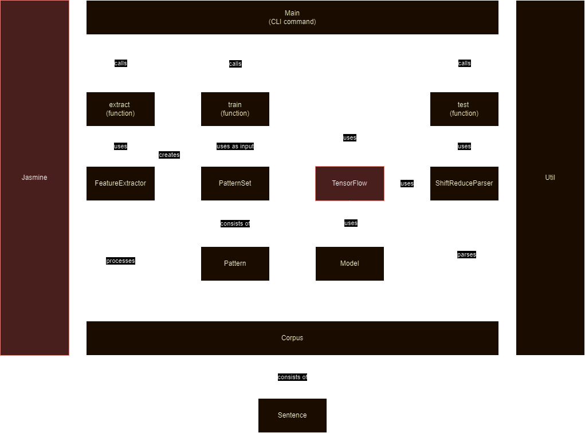

# Introduction
This package offers a shift-reduce parser for dependency grammar that can be trained on corpora from Universal Dependencies. It uses a back propagation network from TensorFlow to train the model.


# Installation
```bash
npm install dep-parser
```

# Structure of the module
Here is an overview of the modules and classes it consists of:




# Usage
The scripts for extracting feature patterns, training and testing the model are configured in `Config.js`. It allows configuration of all input and output files, configuration of the feature extraction, the neural network itself, and training.

There is a Nodejs script `main` that has the following options:
- extract
- train
- test
- iterate

## Extraction configuration items
| Variable | Description | Default value | Environment variable |
| --- | --- | --- | --- |
| corpusTrain | Path to the training corpus | | CORPUS_TRAIN |
| failedSentencesFile | Path to the file where failed sentences are saved | | FAILED_SENTENCES_FILE |
| formFile | Path to the form file | | FORM_FILE |
| lemmaFile | Path to the lemma file | | LEMMA_FILE |
| upostagFile | Path to the upostag file | | UPOSTAG_FILE |
| patternsFile | Path to the patterns file | | PATTERNS_FILE |
| extractResultsFile | Path to the file where the results of the extraction are saved | | EXTRACT_RESULTS_FILE |
| stackDepth | Depth of the stack | | STACK_DEPTH |
| bufferDepth | Depth of the buffer | | BUFFER_DEPTH |

## Training configuration items
| Variable | Description | Default value | Environment variable |
| --- | --- | --- | --- |
| patternsFile | Path to the patterns file | | PATTERNS_FILE |
| formFile | Path to the form file | | FORM_FILE |
| lemmaFile | Path to the lemma file | | LEMMA_FILE |
| upostagFile | Path to the upostag file | | UPOSTAG_FILE |
| modelFile | Path to the model file | | MODEL_FILE |
| trainResultsFile | Path to the file where the results of the training are saved | | TRAIN_RESULTS_FILE |

## Tensorflow configuration items
| Variable | Description | Default value | Environment variable |
| --- | --- | --- | --- |
| TensorFlow.layers[0].units | Number of units in the input layer | | TENSORFLOW_INPUTLAYER_UNITS |
| TensorFlow.layers[0].activation | Activation function for the input layer | | TENSORFLOW_INPUTLAYER_ACTIVATION |
| TensorFlow.layers[1].units | Number of units in the hidden layer | | TENSORFLOW_HIDDEN_LAYER_UNITS |
| TensorFlow.layers[1].activation | Activation function for the hidden layer | | TENSORFLOW_HIDDENLAYER_ACTIVATION |
| TensorFlow.layers[2].units | Number of units in the output layer | | TENSORFLOW_OUTPUT_LAYER_UNITS |
| TensorFlow.layers[2].activation | Activation function for the output layer | | TENSORFLOW_OUTPUTLAYER_ACTIVATION |
| TensorFlow.optimizer | Optimizer for the model | | TENSORFLOW_OPTIMIZER |
| TensorFlow.loss | Loss function for the model | | TENSORFLOW_LOSS |
| TensorFlow.metrics | Metrics for the model | | TENSORFLOW_METRICS |
| TensorFlow.batchSize | Batch size for the model | | TENSORFLOW_BATCH_SIZE |
| TensorFlow.epochs | Number of epochs for the model | | TENSORFLOW_EPOCHS |

## Testing configuration items
| Variable | Description | Default value | Environment variable |
| --- | --- | --- | --- |
| corpusTest | Path to the test corpus | | CORPUS_TEST |
| testResultsFile | Path to the file where the results of the testing are saved | | TEST_RESULTS_FILE |
| modelFile | Path to the model file | | MODEL_FILE |

## Iteration configuration items
| Variable | Description | Default value | Environment variable |
| --- | --- | --- | --- |
| iterate.commands | A list (array) of commands to execute | | - |
| iterate.configItem | Configuration item to iterate | | - |
| iterate.values | A list (array) of possible values to iterate | | - |


# Conllu Format
The package parses Universal Dependencies Conllu format. The Corpus class is used to load and save corpora in CoNLL-U format.
```javascript
import Corpus from './Corpus.js';
import config from './Config.js';

const corpus = new Corpus()
// Second parameter tells the class to build vocabularies from the corpus
corpus.load(config.corpusTrain, true)
```

# Algorithm
Basically, the shift-reduce algorithm is as follows:
```pseudo
arcs = []
while not buffer.isEmpty() or stack.size() > 1:
    action = getBestAction(stack, buffer)
    switch action:
        case 'shift':
            shift(buffer, stack)
        case 'leftArc':
            newArc = leftArc(stack, arcs)
            arcs.push(newArc)
        case 'rightArc':
            newArc = rightArc(stack, buffer, arcs)
            arcs.push(newArc)
        default:
            error('Unknown action: ' + action)
return arcs
```
The ML component is in the getBestAction function that uses the pretrained model to predict the best action.


# Feature extraction
The feature extraction is done with the `extractFeatures` function. Currently it extracts the form and upostag of the tokens in the stack and buffer. Both are extracted two deep. The word forms are normalized (values between 0 and 1) and the POS tags are one-hot encoded.


# Dependencies
- [tensorflow/tfjs-node](https://www.npmjs.com/package/@tensorflow/tfjs-node) for the neural network
- [Jasmine](https://www.npmjs.com/package/jasmine) for testing with Jasmine


# References
- [Universal Dependencies](https://universaldependencies.org/)
- [CoNLL-U format](https://universaldependencies.org/format.html)
- [TFJS](https://www.npmjs.com/package/@tensorflow/tfjs-node)
- [Jasmine](https://www.npmjs.com/package/jasmine)


# Authors
Hugo W.L. ter Doest, Ugo Software


# License
This package is licensed under the [EUPL-1.2](https://spdx.org/licenses/EUPL-1.2.html) license.